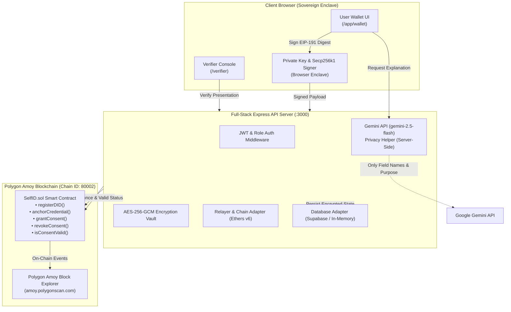

# SelfID — Sovereign Identity Wallet & Verification Portal

## Overview
SelfID is a self-sovereign identity wallet and zero-knowledge verification portal that gives users full ownership over their credentials. Instead of handing over raw documents or full identity cards to third parties, users can selectively disclose only the minimal verified attributes required for a specific purpose. Built with W3C Verifiable Credentials and anchored on the Polygon blockchain via gasless EIP-712/EIP-191 relayers, SelfID ensures third-party verifiers can cryptographically confirm claims without ever accessing unshared personal data.

---

## Features

- **Decentralized Identifiers (DIDs)**: Generates W3C-compliant `did:selfid:<address>` with secp256k1 ECDSA keypairs held in client-side secure browser storage (`localStorage` enclave).
- **Encrypted Document Vault**: Uploaded sample college ID documents are parsed via OCR, encrypted on the server with AES-256-GCM using unique IVs and auth tags, and decrypted strictly for the authenticated holder.
- **On-Chain Credential Anchoring**: Computes immutable SHA-256 digests (`credential_hash`) and anchors fingerprints on the smart contract without ever putting personal information on the blockchain.
- **Selective Disclosure**: Users inspect requests and choose exactly which attributes to disclose via individual checkboxes.
- **AI Privacy Request Helper**: An intelligent server-side helper powered by the Gemini 2.5 Flash API that analyzes the verifier's purpose against requested field names to explain what is needed in 2–3 plain sentences, flags unnecessary fields, and provides interactive quick chips: *"Is this safe?"*, *"What if I say no?"*, and *"Can I take it back later?"*.
- **Gasless Relayer Architecture**: Users sign typed digests (EIP-712 / EIP-191) in the browser, and an automated relayer submits transactions on-chain so end-users never need to hold MATIC or pay gas.
- **Live Contract Event Status & Explorer Tracking**: On `/app/history`, every granted and revoked permission displays its verified status from smart contract events (`ConsentGranted` / `ConsentRevoked`), provides direct *"View on explorer"* links, and falls back gracefully to the database if the chain is slow.
- **Instant Revocation ("Take Back Access")**: One-click revocation signs a revocation digest and calls the contract's `revokeConsent` function, immediately invalidating any active verifier sessions.
- **Verifier Console & Verification Engine**: Verifiers can issue structured verification requests, verify ECDSA presentations against on-chain DIDs and consent hashes, and inspect results.
- **Dual-Mode Operation**: Runs either fully connected to live Supabase and Polygon Amoy testnet or in a standalone zero-dependency in-memory cryptographic mode for local evaluation.

---

## Tech Stack

- **Frontend**: React 19, TypeScript, Vite, Tailwind CSS v4, Lucide React, Motion
- **Backend**: Node.js, Express, TypeScript (`tsx`)
- **Blockchain & Cryptography**: Ethers.js v6, Solidity (`contracts/SelfID.sol`), Polygon Amoy Testnet (Chain ID: 80002), Node.js `crypto` (AES-256-GCM, SHA-256, ECDSA)
- **AI & Document Processing**: Google GenAI SDK (`@google/genai`) with Gemini 2.5 Flash for the Privacy Helper and Gemini 3.8 Flash for sample document extraction
- **Database & Auth**: Supabase (PostgreSQL, Row Level Security, Realtime, JWT Auth) with automatic cryptographic in-memory fallback
- **Schema Validation**: Zod

---

## Architecture Diagram



---

## What is Stored On-Chain vs. Off-Chain

| Data Element | Stored On-Chain | Stored Off-Chain | Notes |
| :--- | :---: | :---: | :--- |
| **Personal Identity Details** (Name, DOB, Student ID, Course) | ❌ **Never** | ✅ (Encrypted) | Encrypted with AES-256-GCM inside server vault; raw values never touch the chain. |
| **Document Image / PDF File** | ❌ **Never** | ❌ Not stored | Processed in-memory; only encrypted field attributes and storage reference retained. |
| **User DID & Public Key** | ✅ (`registerDID`) | ✅ (`dids`) | Public secp256k1 key registered on-chain to verify cryptographic presentation signatures. |
| **Credential Fingerprint (SHA-256)** | ✅ (`anchorCredential`) | ✅ (`credentials`) | 32-byte cryptographic hash anchors proof of existence and tamper detection. |
| **Consent & Permission Records** | ✅ (`grantConsent`) | ✅ (`consents`) | Records `consentId`, `fieldsHash`, `expiresAt`, and revocation flag. |
| **Consent Revocation State** | ✅ (`revokeConsent`) | ✅ (`consents`) | Smart contract immediately sets `revoked = true` and logs `ConsentRevoked` event. |
| **Private Keys** | ❌ **Never** | ❌ **Never on Server** | Kept strictly in client browser secure enclave; never transmitted to server or verifiers. |
| **Relayer Private Key** | ❌ Off-Chain | ✅ (Server `.env`) | Server uses relayer wallet to pay transaction gas fees on behalf of users. |

---

## Contract Address and Network

- **Network**: Polygon Amoy Testnet
- **Chain ID**: `80002`
- **RPC URL**: `https://rpc-amoy.polygon.technology`
- **Contract Address**: `0x5FbDB2315678afecb367f032d93F642f64180aa3` *(Read from `CONTRACT_ADDRESS` environment variable)*
- **Block Explorer Link**: [https://amoy.polygonscan.com/address/0x5FbDB2315678afecb367f032d93F642f64180aa3](https://amoy.polygonscan.com/address/0x5FbDB2315678afecb367f032d93F642f64180aa3)

---

## Setup Steps

### 1. Prerequisites
- **Node.js** v20+ (or **Bun** v1.1+)
- **npm** or **bun**

### 2. Clone and Install
```bash
# Clone the repository
git clone <repository-url>
cd selfid-wallet

# Install all dependencies
npm install
```

### 3. Configure Environment Variables
Create a local `.env` file from `.env.example`:
```bash
cp .env.example .env
```
Ensure `.env` contains valid configurations (refer to the Environment Variables section below).

### 4. Run Locally
```bash
# Start the full-stack development server (Express API + Vite frontend on port 3000)
npm run dev
```
Open **`http://localhost:3000`** in your browser.

---

## Environment Variables (.env.example)

All environment variables use standard placeholder values with **no secrets**:

```dotenv
# ==============================================================================
# SelfID — Sovereign Identity Wallet Environment Configuration
# ==============================================================================

# Server Configuration
PORT=3000
APP_URL="http://localhost:3000"

# Frontend & Supabase Configuration
# Optional: if omitted, SelfID runs in secure cryptographic in-memory mode
VITE_SUPABASE_URL="https://your-project-id.supabase.co"
VITE_SUPABASE_ANON_KEY="your-anon-public-key"
SUPABASE_SERVICE_ROLE_KEY="your-supabase-service-role-secret-key"

# Server Cryptographic Key
# 32-byte hex string (64 characters) or passphrase for AES-256-GCM encryption
CREDENTIAL_ENCRYPTION_KEY="0123456789abcdef0123456789abcdef0123456789abcdef0123456789abcdef"

# Gemini API Key (Server-Side only)
# Used for Document OCR and the Request Privacy Helper
GEMINI_API_KEY="your-gemini-api-key"

# SelfID Smart Contract & Relayer Configuration (Ethers v6)
# Set CHAIN_MODE="mock" for signature-verified local simulation; "live" for Polygon Amoy
CHAIN_MODE="mock"
CONTRACT_ADDRESS="0x5FbDB2315678afecb367f032d93F642f64180aa3"
CHAIN_ID="80002"
RPC_URL="https://rpc-amoy.polygon.technology"
RELAYER_PRIVATE_KEY="0x0123456789abcdef0123456789abcdef0123456789abcdef0123456789abcdef"

# Optional test balance override: strictly ignored unless DEMO_MODE="test-balance"
# TEST_RELAYER_BALANCE="1.5"

# Live Demo Settings
DEMO_MODE="true"
VITE_DEMO_MODE="true"
```

> **Note on Relayer Balance**: When `CHAIN_MODE=live`, the app reads the real relayer wallet balance directly from the blockchain via `provider.getBalance(relayer.address)`. The obsolete `MOCK_RELAYER_BALANCE` variable has been completely removed.

---

## Step-by-Step Demo Script

Follow this step-by-step path to test the entire SelfID flow:

1. **Launch the Application**:
   - Navigate to `http://localhost:3000`.
   - Click **"Launch Wallet"** to log in as a student user (`USER` role).
2. **Initialize Identity**:
   - On the Wallet page (`/app/wallet`), your sovereign DID (`did:selfid:0x...`) is initialized with a client-side ECDSA keypair in the browser enclave.
3. **Add a College Document**:
   - Click **"+ Add a document"** (`/app/add-document`).
   - Select one of the sample college ID cards provided (e.g. *Valid College ID* or *Other College ID*).
   - Click **"Upload & Read Document"**. The server inspects the document, extracts the fields, locks them with AES-256-GCM, and anchors the SHA-256 hash on-chain.
   - Click **"Lock and Save in Safe"**. Your document now appears in the wallet.
4. **Switch to Verifier Portal**:
   - In the navigation bar, switch to the **"Verifier Portal"** (`/verifier`).
   - Click **"+ New Request"** (`/verifier/new`) or use the Quick Request Creator on `/verifier`.
   - Set purpose to: *"College Enrollment Verification for Campus Access"*.
   - Check requested fields: `College / Institution`, `Student Enrollment Status`, `Full Legal Name`, and `Student ID`.
   - Click **"Send Verification Request"**.
5. **Review Request as User with Privacy Helper**:
   - Switch back to the student wallet and go to **"Incoming Requests"** (`/app/requests`).
   - Open the pending request (`/app/requests/:id`).
   - Notice the **Helper Box**:
     - Explains in 2–3 sentences what the organization is asking and points out that sensitive details like Student ID or Date of Birth are not needed for enrollment verification.
     - Click the quick chips:
       - **"Is this safe?"**: Explains selective disclosure and client encryption.
       - **"What if I say no?"**: Confirms that declining shares zero data.
       - **"Can I take it back later?"**: Explains one-click revocation.
6. **Selective Disclosure & Confirmation**:
   - Uncheck unnecessary fields (e.g., leave *Student ID* unchecked; leave *College / Institution* checked).
   - Click **"Confirm & Share Selected Details"**.
   - The browser signs the presentation with the student's ECDSA key, and the relayer submits the permission on-chain.
7. **Verifier Verification**:
   - Return to the Verifier Console and view the result (`/verifier/results/:id`).
   - The verifier verifies the cryptographic signature against the student's on-chain DID public key, confirms the hash matches, and displays **only** the selected fields.
8. **Audit Trail & "Take Back Access"**:
   - Go to **"Permission History"** (`/app/history`).
   - Inspect the permission row:
     - Status shows `ConsentGranted` from contract events.
     - Click **"View on explorer"** to view the transaction on the Polygon Amoy explorer.
   - Click **"Take back access"**.
   - Confirm revocation: the smart contract updates on-chain to `ConsentRevoked`.
   - Re-running verification on the Verifier Console now immediately fails with *"Access Taken Back on Public Record"*.

---

## Limits of This Prototype

- **Sample Documents Only**: This prototype is tailored for sample college ID cards and student attestations to demonstrate the selective disclosure and zero-knowledge verification lifecycle.
- **Relayer Pays Gas**: All blockchain transactions are relayed via a server-funded relayer wallet for frictionless UX. Users do not pay transaction fees or manage gas tokens.
- **Production Key Storage & Trusted Issuers**: In a full enterprise production deployment:
  - Verifiable credentials would be cryptographically issued and signed directly by accredited university registrar systems (trusted issuers).
  - Holder private keys would be backed by hardware-backed Secure Enclaves (FIPS 140-2, WebAuthn / Passkeys) or mobile identity vaults rather than browser `localStorage`.

---

## Commands to Run Locally

```bash
# 1. Install dependencies
npm install

# 2. Start the development server (runs backend API and frontend on port 3000)
npm run dev

# 3. Build for production
npm run build

# 4. Start production server
npm start
```
